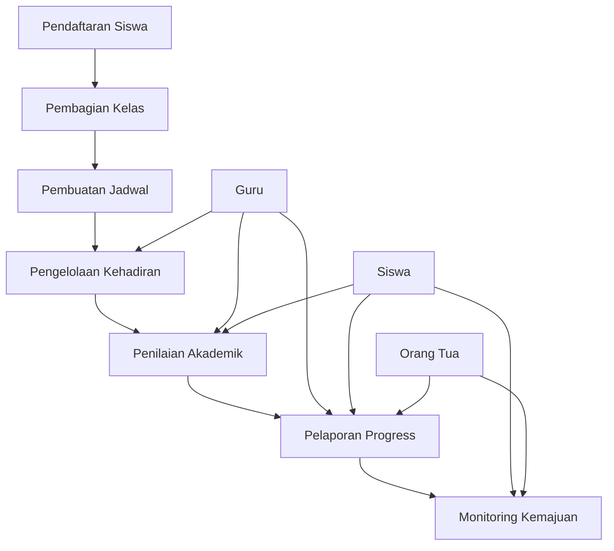

# Sistem Informasi Sekolah (SIS)


## Ringkasan Sistem

Sistem Informasi Sekolah (SIS) ini dirancang untuk mendukung operasional akademik sekolah jenjang SD/SMP/SMA dengan arsitektur multi-tenant (SaaS) yang sudah ada. Sistem akan fokus pada manajemen akademik terlebih dahulu dengan kemampuan untuk menambahkan fitur keuangan di masa depan.

## 🎯 User Roles & Tindakan yang Diperbolehkan

### 1. **Superintendent / Kepala Sekolah**
**Role Code:** `ROLE_SUPERINTENDENT`

**Tindakan Utama:**
- Pengelolaan seluruh sistem di level sekolah
- Pembuatan dan pengelolaan jadwal pelajaran
- Penetapan kurikulum dan mata pelajaran
- Pengelolaan guru dan kelas
- Monitoring kinerja akademik sekolah
- Generate laporan akademik sekolah
- Pengelolaan pengguna dan akses

**Fitur Spesifik:**
- Dashboard overview sekolah
- Jadwal pelajaran komprehensif
- Distribusi beban kerja guru
- Analisis hasil belajar sekolah
- Manajemen kalender akademik

### 2. **Guru / Wali Kelas**
**Role Code:** `ROLE_TEACHER`

**Tindakan Utama:**
- Input nilai siswa
- Input kehadiran siswa
- Penilaian harian dan uts/uas
- Pengelolaan tugas dan materi pelajaran
- Komunikasi dengan siswa dan orang tua
- Generate laporan kelas

**Fitur Spesifik:**
- Dashboard kelas
- Input nilai per mata pelajaran
- Tracking kemajuan siswa
- Manajemen tugas dan deadline
- Komunikasi dengan orang tua

### 3. **Siswa**
**Role Code:** `ROLE_STUDENT`

**Tindakan Utama:**
- Melihat jadwal pelajaran
- Melihat nilai dan hasil belajar
- Melihat kehadiran
- Mengumpulkan tugas online
- Komunikasi dengan guru
- Tracking kemajuan diri

**Fitur Spesifik:**
- Dashboard pribadi siswa
- Riwayat nilai dan predikat
- Daftar tugas dan deadline
- Riwayat kehadiran
- Materi pembelajaran online

### 4. **Orang Tua / Wali**
**Role Code:** `ROLE_PARENT`

**Tindakan Utama:**
- Melihat nilai anak
- Melihat kehadiran anak
- Melihat jadwal pelajaran anak
- Komunikasi dengan guru
- Tracking perkembangan akademik
- Pesan sekolah

**Fitur Spesifik:**
- Dashboard anak
- Riwayat akademik lengkap
- Monitoring kehadiran
- Komunikasi dengan guru
- Notifikasi penting

### 5. **Tenaga Kependidikan / TU**
**Role Code:** `ROLE_STAFF`

**Tindakan Utama:**
- Manajemen data siswa (pendaftaran, mutasi, kelulusan)
- Manajemen data guru dan karyawan
- Pengelolaan administrasi sekolah (surat-menyurat, arsip)
- Pengelolaan keuangan sekolah (pembayaran SPP, tagihan, gaji)
- Pengelolaan inventaris sekolah
- Generate laporan administrasi dan keuangan

**Fitur Spesifik:**
- Dashboard administrasi
- Modul pendaftaran siswa baru
- Modul manajemen data karyawan
- Modul keuangan (pembayaran, tagihan, laporan keuangan)
- Modul inventaris
- Manajemen surat-menyurat

### 6. **Operator Sekolah**
**Role Code:** `ROLE_OPERATOR` (sudah ada)

**Tindakan Utama:**
- Input data siswa baru
- Input data guru baru
- Pembuatan akun pengguna
- Manajement data master
- Generate laporan operasional

**Fitur Spesifik:**
- Pendaftaran siswa/guru
- Manajement data profil
- Generate laporan administrasi
- Backup dan restore data

### 7. **Administrator Sistem**
**Role Code:** `ROLE_ADMIN` (sudah ada)

**Tindakan Utama:**
- Pengelolaan multi-sekolah (SaaS)
- Konfigurasi sistem
- Manajement pengguna global
- Monitoring sistem
- Update versi sistem

**Fitur Spesifik:**
- Dashboard multi-sekolah
- Konfigurasi aplikasi
- Manajement roles & permissions
- Monitoring performa sistem

## 🏗️ Arsitektur Sistem

### Struktur Database Tambahan

```mermaid
erDiagram
    users ||--o{ user_profiles : "has"
    users ||--o{ student_enrollments : "enrolls"
    users ||--o{ teacher_assignments : "assigned"
    users ||--o{ parent_students : "has_child"
    
    schools {
        uuid id PK
        string name
        string code
        string address
        string phone
        string email
        string logo
        boolean is_active
        timestamps
    }
    
    school_levels {
        uuid id PK
        string name
        string code
        string description
        timestamps
    }
    
    academic_years {
        uuid id PK
        string name
        string year_code
        date start_date
        date end_date
        uuid school_id FK
        boolean is_active
        timestamps
    }
    
    classes {
        uuid id PK
        string name
        string class_code
        uuid school_id FK
        uuid level_id FK
        uuid homeroom_teacher_id FK
        timestamps
    }
    
    subjects {
        uuid id PK
        string name
        string code
        string description
        uuid school_id FK
        timestamps
    }
    
    schedules {
        uuid id PK
        uuid class_id FK
        uuid subject_id FK
        uuid teacher_id FK
        string day_of_week
        time start_time
        time end_time
        string room
        timestamps
    }
    
    enrollments {
        uuid id PK
        uuid student_id FK
        uuid class_id FK
        uuid academic_year_id FK
        string status
        date enrollment_date
        timestamps
    }
    
    attendances {
        uuid id PK
        uuid enrollment_id FK
        uuid teacher_id FK
        date attendance_date
        string status
        string notes
        timestamps
    }
    
    grades {
        uuid id PK
        uuid enrollment_id FK
        uuid subject_id FK
        uuid teacher_id FK
        string assessment_type
        string score
        string grade
        string notes
        date assessment_date
        timestamps
    }
    
    assignments {
        uuid id PK
        uuid subject_id FK
        uuid teacher_id FK
        string title
        text description
        string assignment_type
        datetime due_date
        datetime submission_start
        datetime submission_end
        timestamps
    }
    
    submissions {
        uuid id PK
        uuid assignment_id FK
        uuid student_id FK
        text content
        string file_path
        string status
        datetime submitted_at
        timestamps
    }
```

### Alur Proses Akademik



## 📊 Fitur Akademik Inti

### 1. **Manajemen Master Data**
- Sekolah (Multi-tenant)
- Tingkat Pendidikan (SD/SMP/SMA)
- Tahun Ajaran
- Kelas & Jurusan
- Mata Pelajaran
- Guru & Siswa
- Kurikulum

### 2. **Jadwal Pelajaran**
- Pembuatan jadwal otomatis
- Konflik jadwal detection
- Jadwal per kelas/guru
- Jadwal mobile-friendly
- Notifikasi perubahan jadwal

### 3. **Kehadiran & Absensi**
- Input kehadiran harian
- Rekap kehadiran bulanan
- Sistem izin & sakit
- Notifikasi kehadiran ke orang tua
- Laporan kehadiran lengkap

### 4. **Penilaian Akademik**
- Input nilai harian, uts, uas
- Perhitungan rapor otomatis
- Grading system kustom
- Predikat & keterangan
- Progress tracking per semester

### 5. **Tugas & Materi Pembelajaran**
- Upload tugas online
- Deadline management
- Materi pembelajaran digital
- Sistem pengumpulan tugas
- Feedback guru-siswa

### 6. **Komunikasi & Notifikasi**
- Sistem pesan internal
- Email & SMS notification
- Announcements sekolah
- Orang tua-guru communication
- Mobile notification

### 7. **Pelaporan & Analytics**
- Dashboard akademik
- Progress report siswa
- Laporan kelas/sekolah
- Analisis hasil belajar
- Export data (PDF/Excel)

## 🔧 Integrasi & Teknis

### **Teknologi Stack**
- **Backend:** Laravel 11+ (existing)
- **Frontend:** Blade/TailwindCSS (existing)
- **Database:** PostgreSQL/MySQL
- **Storage:** Local/Cloud Storage
- **Notification:** Email, SMS, Push Notification

### **API Requirements**
- RESTful API for mobile apps
- Webhook for external integrations
- Real-time updates (WebSocket)
- Export/Import data formats

### **Security & Compliance**
- Role-based access control (existing)
- Data encryption
- Audit logging
- GDPR compliance
- Backup & recovery

## 📱 User Interface Requirements

### **Dashboard Design**
- **Superintendent:** Overview sekolah dengan metrics kunci
- **Guru:** Dashboard kelas dengan tugas & nilai
- **Siswa:** Dashboard pribadi dengan progress belajar
- **Orang Tua:** Dashboard anak dengan aktivitas akademik
- **Operator:** Dashboard administrasi & data entry
- **Tenaga Kependidikan / TU:** Dashboard administrasi dan keuangan

### **Responsive Design**
- Mobile-first approach
- Tablet & desktop optimization
- Offline capability (mobile apps)
- Accessibility compliance

## 📅 Implementasi Roadmap

### **Phase 1: Core Academic System (2-3 bulan)**
- Setup multi-tenant structure
- Implement user roles
- Master data management
- Basic scheduling system
- Attendance tracking

### **Phase 2: Academic Management (2-3 bulan)**
- Grading system
- Assignment management
- Progress reporting
- Basic communication

### **Phase 3: Advanced Features (1-2 bulan)**
- Analytics & reporting
- Mobile interface
- Integration capabilities
- Performance optimization

### **Phase 4: Financial Module (Future)**
- Tuition fee management
- Payment tracking
- Expense management
- Billing system

---
